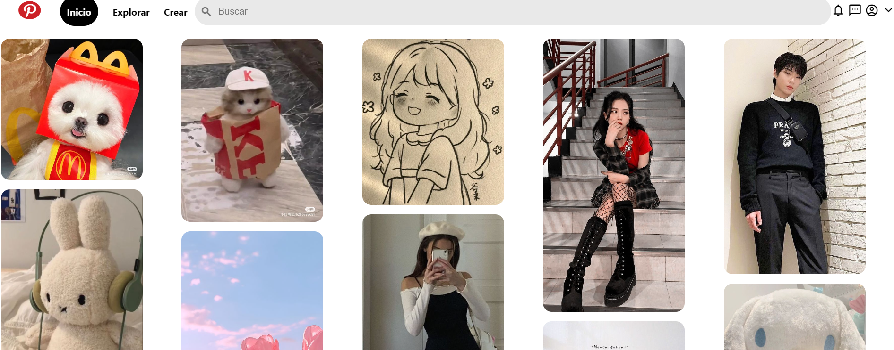

# Pinterest-2.0 con HTML y CSS
Este proyecto es un clon de la interfaz de pinterest, creado con HTML y CSS3

Se enfoca en replicar la apariencia visual de pinterest ofreciendo una experiencia similar 

### Caracteristicas

* Diseño responsive: Adaptable a diferentes tamaños de pantalla para una experiencia de usuario optima en dispositivos de escritorio
* Interfaz de usuario intuitiva: Inspirada en pinterest con una navegacion facil y accesible
* *Interacciones Dinámicas:* Efectos visuales para elementos interactivos como botones y enlaces
* *Iconografía y Estilos Modernos:* Uso de la biblioteca de íconos de Material Design y estilos CSS modernos para una apariencia cool.
### Tecnologías Utilizadas
+ *HTML5:* Para la estructura básica del sitio.
+ *CSS3:* Para el diseño y el estilo, incluyendo flexbox para un diseño responsivo y efectos de hover.
+ *Google Fonts:* Para fuentes personalizadas.

### Vista Previa del Proyecto

### Contacto
Si te gustaría invitarme a colaborar en un proyecto, escríbeme por [LinkedIn](https://www.linkedin.com/in/lesly-gabriela-quiroz-bueno-b0b346183)
